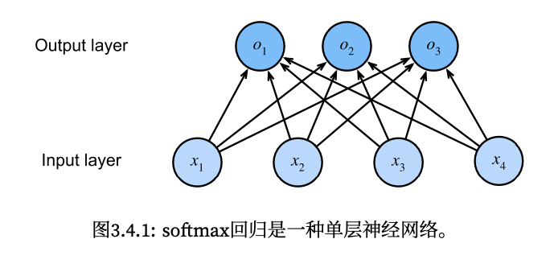

## 梯度下降

在机器学习中，我们通常使用梯度下降来对模型进行训练。其实梯度下降也有三种不同的种类。

设损失函数为 $J$，模型参数为 $\theta$，样本数量为 $m$，学习率为 $\eta$


### 批量梯度下降 BGD

是梯度下降算法最原始的形式。在更新一个参数时，要使用所有样本。即：

$\hat{\theta_i} = \theta_i-\frac{\eta}{m}\sum_{i=1}^m\frac{\partial J}{\partial\theta_i}$

优势：全局最优解，易于并行实现。

不足：样本太多训练速度会很慢。


### 随机梯度下降 SGD

BGD在更新一次参数时都要用到所有的样本，而且样本越多训练越慢。SGD就是为了解决训练速度减慢而提出的。每计算一个样本就更新一次梯度。即：

$\hat{\theta_i} = \theta_i-\eta\frac{\partial J}{\partial\theta_i}$

优势：训练速度快。

不足：不易并行实现，准确度不够，可能不是全局最优解。


### 小批量梯度下降 MBGD

SGD和BGD的折衷，若以 $B$ 表示 batch size，那么：

$\hat{\theta_i} = \theta_i-\frac{\eta}{B}\sum_{i=1}^B\frac{\partial J}{\partial\theta_i}$


## 用pytorch实现线性回归

本小节简单介绍如何使用pytorch来简洁地实现一个线性回归模型。


### 定义模型


#### Sequential

Sequential类为串联在一起的多个层定义了一个容器。当给定输入数据，Sequential实例将数据传入到第一层，然后将第一层的输出作为第二层的输入，以此类推。在本例中，只包含一个层。

Linear是全连接层，参数1表示输入维度，参数2表示输出维度。

```python
form torch import nn
nent = nn.Sequential(nn.Linear(2,1))
```


#### 参数初始化

我们可以通过`net[index]`来给第index层设置参数。如：

```python
net[0].weight.data.normal_(0, 0.01)
net[0].bias.data.fill_(0)
```


#### 定义损失函数

使用MSE。

```python
loss = nn.MSELoss()
```


#### 定义优化算法

在optim模块中实现了许多优化算法。这里以MSGD为例，我们使用`net.parameters()`方法获取参数，然后设置学习率为0.03：

```python
trainer = torch.optim.SGD(net.parameters(), lr=0.03)
```


#### 训练

我们训练的主要步骤一般为：

1. 生成预测并计算loss （前馈）
2. bp算梯度
3. 调用优化器来更新参数

```python
num_epochs = 3
for epoch in range(num_epochs):
	for X, y in data_iter: 
    l = loss(net(X), y) 
    trainer.zero_grad() 
    l.backward() 
    trainer.step()
	l = loss(net(features), labels) 
  print(f'epoch {epoch + 1}, loss {l:f}')
```


## softmax回归

上一节中我们介绍了简单的linear regression做法。regression可以用于预测 “多少” 的问题。比如预测房屋价格等。而现实中，我们常对“分类”感兴趣。

在分类问题中，我们常用one-hot encoding来表示不同种类。比如：(1,0,0)对应猫，(0,1,0)对应狗，(0,0,1)对应鸡。而且我们通常计算的是不同种类的预测概率，所以我们需要一个多输出模型，每个类别对应一个输出，每个类别有一个自己的affine function。

☞ **affine function：**由一阶多项式成的函数，一般形式为$f(x)=Ax+b$ 。作用主要是进行维度改变或者形状，方向改变。

softmax回归也是一个单层神经网络。




### softmax运算

我们在分类里采用的主要方法是将模型的输出视作概率，选择具有最大输出值的类别作为我们的预测。这个过程需要进行一次归一化。以上图为例，直接将未归一化的 $o$ 视为概率是不可取的。因为没有限制它们的和为1，而且根据输入的不同它们可以是负值。这违反了概率论基本公理。softmax函数实现了归一化的同时，保证了模型可导：

$softmax(o_i)=\frac{exp(o_i)}{\sum_j exp(o_j)}$

尽管softmax是非线性函数， 但回归的输出仍然由输入特征的仿射变换决定。所以它还是线性模型。


### 线性模型和非线性模型

线性模型的分类决策边界是直线。区分是否为线性模型，主要是看一个乘法式子中自变量x前的系数w,如果w只影响一个x，那么此模型为线性模型。或者判断决策边界是否是线性的。如：

$\frac{1}{e^{w_1x_1+w_2x_2}}$	线性

$\frac{1}{w_3e^{w_1x_1+w_2x_2}}$	非线性


### Cross-entropy

我们依赖最大似然估计来度量概率预测的结果。

softmax函数给出了一个向量 $\hat{y}$ ，我们可以将其视为给定任意输入 $x$ 的每个类的估计条件概率。如 $\hat{y_1}=P(y=猫\vert x)$。

假设整个数据集有$n$个样本，m个类别，第$i$个样本的label为$y_i$ ，softmax函数输出的为$\hat{y}_i$ ，输入特征为 $x_i$ ，那么：

$P(Y\vert X)=\prod_{i=1}^nP(y_i\vert x_i)$	即模型根据输入，输出正确分类的概率。

我们的目标为最大化$P(Y\vert X)$

取对数，$logP(Y\vert X)=-\frac{1}{n}\sum_i \sum^m_{c=1}y_{ic}log(p_{ic})$

其中，$y_{ic}在样本$ $i$ 的真实类别等于 $c$ 时取1，否则取0。

$p_{ic}$表示样本 $i$ 属于类别 $c$ 的概率。


### softmax的数值稳定性问题

softmax的式子如下：

$softmax(o_i)=\frac{exp(o_i)}{\sum_j exp(o_j)}$

你也注意到了，假如我有一个 $o_j$ 很大，那么它的$exp$会远大于其他的$exp$，那最终可能会出现它的softmax值趋向于1，其他的全趋向于0的情况。或者它很小，它的$exp$趋向于0。这些情况在bp中会引发问题。

**LogSumExp技巧：**反正我们后面要求softmax的导数的时候会取$ln$，那直接取对数就好了。通过将softmax和交叉熵结合在一起可以避免bp中可能出现的数值稳定性问题。我们没有将softmax概率传递到损失函数中，而是在交叉熵损失函数中传递未归一化的预测，并同时计算softmax及其对数。即：

$ln(\hat{y_i})=ln(softmax(o_i))$

​			$=o_i-ln(\sum_jexp(o_j))$